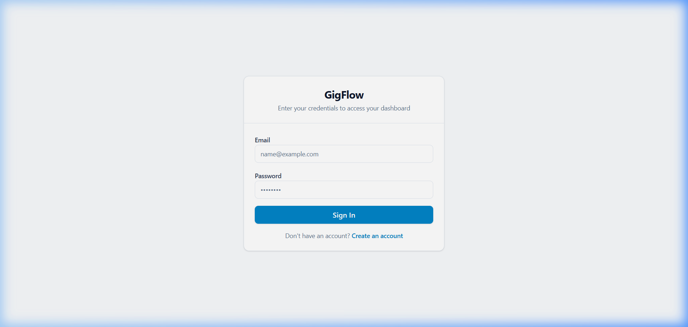
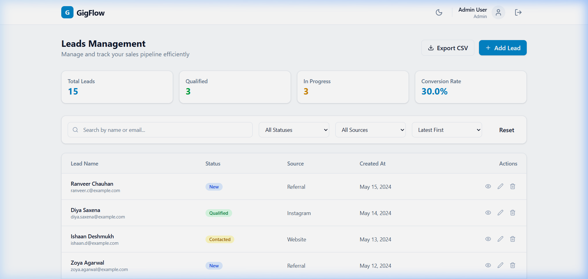
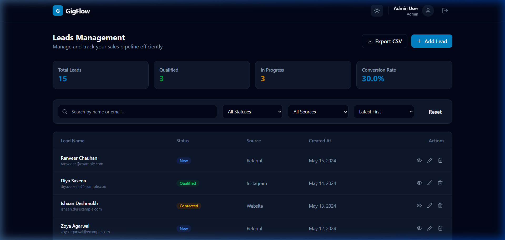
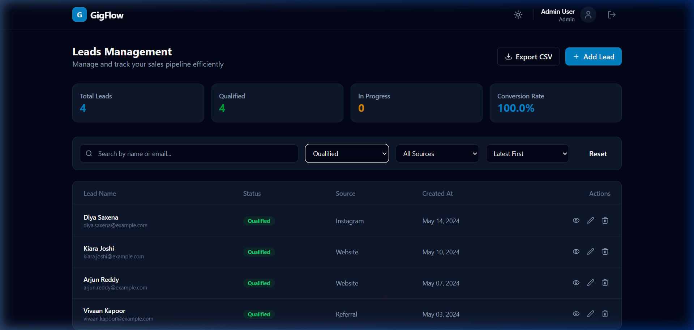
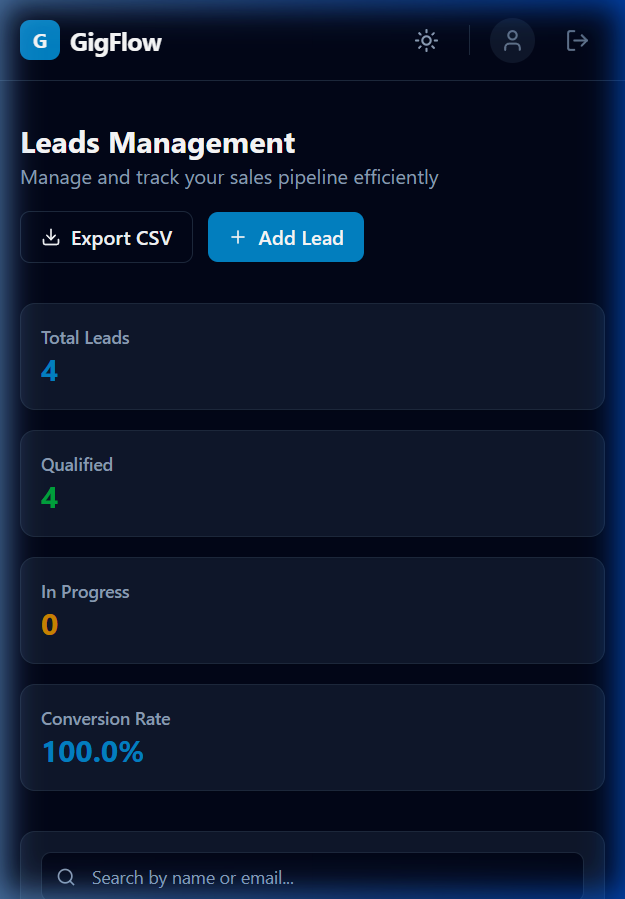

# GigFlow - Smart Leads Dashboard

GigFlow is a premium full-stack Lead Management Dashboard designed to streamline sales workflows. Built with the MERN stack and TypeScript, it offers a secure, scalable, and highly interactive experience for managing business leads.

## Live Demo
[Link to your hosted project here]

## Features
- **Comprehensive Lead CRUD**: Effortlessly create, view, update, and delete leads.
- **Detailed Lead Insights**: View full lead profiles including status, source, and creation history.
- **Advanced Real-Time Filtering**: Dynamic filtering by status and source combined with a debounced search.
- **Premium UI/UX**: Professional dashboard with smooth animations, loading states, and dark mode support.
- **Scalable Data Handling**: Efficient backend pagination for large datasets.
- **CSV Data Export**: Export lead records for external reporting and analysis.

## Tech Stack
- **Frontend**: React.js, TypeScript, TailwindCSS, Framer Motion, Lucide React.
- **Backend**: Node.js, Express.js, TypeScript, Mongoose.
- **Database**: MongoDB.
- **Validation**: Zod (Schema-based validation).
- **Authentication**: JWT (JSON Web Tokens) & Bcryptjs.

## Authentication
- **Secure Flow**: JWT-based authentication with cookies/bearer token support.
- **Protected Routes**: Middleware-driven route protection for all dashboard features.
- **Password Security**: Robust hashing using Bcryptjs.

## Role-Based Access
- **Admin**: Full access to all features, including the exclusive ability to delete leads.
- **Sales User**: Access to view, create, and update leads, restricted from deletion to ensure data integrity.

## Filtering & Pagination
- **Multi-Filter Support**: Combine search queries with status and source filters simultaneously.
- **Optimized Search**: Debounced search bar to minimize API overhead.
- **Backend Pagination**: 10 records per page using MongoDB's `skip` and `limit` for optimal performance.

## CSV Export
- Single-click export of the entire leads database to a formatted CSV file using the `json2csv` library.

## Docker Setup
The project is fully containerized for consistent development and deployment environments.
```bash
docker-compose up --build
```
This command orchestrates the MongoDB, Backend, and Frontend services automatically.

## Folder Structure
```text
GigFlow/
├── client/              # React Frontend
│   ├── src/
│   │   ├── components/  # Reusable UI components
│   │   ├── pages/       # Core application pages
│   │   ├── context/     # Auth state management
│   │   └── types/       # Global TS definitions
├── server/              # Express Backend
│   ├── src/
│   │   ├── controllers/ # Business logic
│   │   ├── models/      # Mongoose schemas
│   │   ├── routes/      # API endpoints
│   │   └── middleware/  # Auth & RBAC logic
└── docker-compose.yml   # Docker orchestration
```

## API Documentation

The API is fully documented using **Swagger** and is accessible directly via the server:
- **Interactive Swagger UI**: [http://localhost:5000/api-docs](http://localhost:5000/api-docs)

Alternatively, you can find the **Postman Collection** in the `docs/` folder:
- **Postman Collection**: [docs/GigFlow.postman_collection.json](./docs/GigFlow.postman_collection.json)

### Auth Endpoints
- `POST /api/auth/register` - Create a new account
- `POST /api/auth/login` - Authenticate and get token
- `GET /api/auth/me` - Get current user profile

### Lead Endpoints
- `GET /api/leads` - List leads (supports query params: search, status, source, page)
- `POST /api/leads` - Create a new lead
- `GET /api/leads/:id` - Get specific lead details
- `PUT /api/leads/:id` - Update lead information
- `DELETE /api/leads/:id` - Delete a lead (Admin only)
- `GET /api/leads/export` - Download leads as CSV

## Setup Instructions
1. **Clone the repo**: `git clone <repo-url>`
2. **Install Dependencies**: 
   - `cd server && npm install`
   - `cd client && npm install`
3. **Configure Environment**: Create `.env` files in both `client` and `server` folders.
4. **Seed Database**: `cd server && npm run seed`
5. **Run Development**: `npm run dev` in both folders.

## Environment Variables
### Server (.env)
- `PORT`: 5000
- `MONGO_URI`: Your MongoDB connection string
- `JWT_SECRET`: Secret key for token signing
- `CLIENT_URL`: URL of the frontend (e.g., http://localhost:5173)

### Client (.env)
- `VITE_API_URL`: URL of the backend API (e.g., http://localhost:5000/api)

## Deployment
- **Frontend**: Vercel.
- **Backend**: Render.
- **Database**: MongoDB Atlas.

## Demo Credentials

### Admin Access
- **Email**: `admin@test.com`
- **Password**: `123456`

### Sales Access
- **Email**: `sales@test.com`
- **Password**: `123456`

## Screenshots

### Login Page


### Dashboard (Light Mode)


### Dashboard (Dark Mode)


### Advanced Filtering


### Mobile Responsive View

